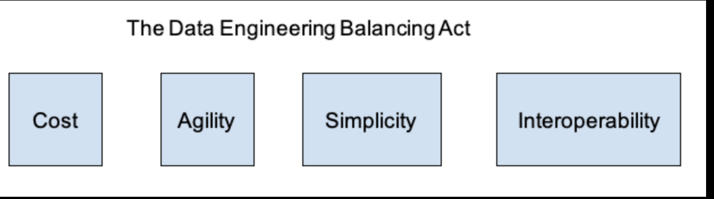

> This is a summarised points which are taken directly from "Fundamentals of Data Engineering, Joe Reis & Matt Housley " by O'Reilly

- [C1. Data Engineering Described](#c1-data-engineering-described)
  - [Data Maturity and the Data Engineer](#data-maturity-and-the-data-engineer)
    - [Example to a data maturity](#example-to-a-data-maturity)
    - [Starting with data](#starting-with-data)
    - [Scaling with data](#scaling-with-data)
    - [Leading with data](#leading-with-data)
    - [Business responsibilities](#business-responsibilities)
    - [Technical Responsibilities](#technical-responsibilities)
    - [Data Engineers and Other Technical Roles](#data-engineers-and-other-technical-roles)

# C1. Data Engineering Described

- In general, a data engineer gets data, stores it and prepares it for consumption by data scientists and analysts. 

- **Data Engineering** is the development, implementation, and maintenance of systems and processes that take in taw data and produce high-quality, consistent information that supports downstream use cases, such as analysis and machine learning. Data engineering is the intersection of data management, DataOps, data architecture, orchestration, and software engineering. 
- A **data engineer** manages the data engineering lifecycle (*Generation > Ingestion > Transformation > Serving > Storage) beginning with ingestion and ending with serving data for use cases, such as analysis or machine learning. 

- In an ideal world, data scientists should spend 90%+ of their time focused on the top layers of the pyramid - analytics, experimentation, and machine learning. When data engineers focus on these bottom parts of the hierarchy given below, they build a solid foundation upon which data scientists can succeed. 

- The Data Engineering Balacing Act is based on Cost, Agility, Simplicity and Interoperability 

- A data engineer was expected to know and understand how to use a small handful of powerful and monolithic technonlogies to create a data solution. Utilizing these technologies (Hadoop, Spark, Teradata, and many others) often required a sophisticated understanding of software engineering, networking, distributed computing, storage or other low-level details. Their work would be devoted to cluster administration and maintenance, managing overhead and writing pipeline and transformation jobs, among other tasks.

- A data engineer typically does not directly build machine learning models, create reports or dashboards, perform data analysis, build KPIs or develop software applications. That said, a data engineer should have a good functioning understanding of all of these areas, in order to best serve stakeholders. 

## Data Maturity and the Data Engineer

- Data naturity is the progression toward higher data utilization, capabilities, and integration across the organization, but data maturity does not simply depend on the age or revenue of a company. 

### Example to a data maturity

### Starting with data

At this stage, a data engineer should focus on followings: 

- Get buy-in from key stakeholders, including executive management. Ideally, the data engineer should have a sponsor for key initiatives to design and build a data architecture to support the company's goals.

- Define the right data architecture (usually solo, since a data architect likely is not available) This means determining business goals, and what competitive advantage you're aiming to achieve with your data initiative. Work towards a data architecture that supports these goals. 

- Identify and audit data that will support key initiatives, and operate within the data architecture that you designed.

- Build a solid data foundation upon which future data analysts and data scientists can generate reports and models that provide competitive value. In the meantime, you may also have to generate these reports and models until this team is hired. 

### Scaling with data 

At this stage, a data engineer's  goals are to:

- Establish formal data practices
- Create scalable and robust data architectures
- Adopt DevOps and DataOps practices
- Build system that support machine learning
- Continue to avoid undifferentiated heavy lifting and customizing only where there's a competitive advantage. 

### Leading with data 

A data engineer will continue building on prior stages, plus: 

- Create automation for the seamless introduction and usage of new data.
- Focus on building custom tools and systems that leverage data as a competitive advantage
- Focus on the "enterprisey" aspects of data. Data management, data serving, DataOps, etc. Deploy tools that expose and disseminate data throughout the organization, including data catalogs, data lineage tools, metadata management systems, etc. 
- Collaborate efficiently with software engineers machine learning engineers, analysts, etc. Create a community and environment where people can collaborate and speak openly, no matter what role or position you're in.

### Business responsibilities

- Know how to communicate with non-technical and technical people. 
  Communication is key, and you need to be able to establish rapport and trust with people across the organization. We suggest paying close attention to organizational hierarchies, who reports to whom, how people interact with each other, and which silos exist. These observations will be invaluable to your success. 

- Undestand how to scope, and how to gather business, and product requirements. 
  Simply put - you need to know what to build and make sure that your stakeholders agree with your assessment. In addition, develop a sense of how data and technology decisions impact the business. 

- Undestanding the cultural foundations of Agile, DevOps and DataOps. Many technologists mistakenly believe these practices are solved through technology. This is dangerously wrong: in fact, they are fundamentally cultural, requiring buy-in across the organization.

- Cost control. You'll be successful when you can keep costs low while providing outsized value. Know how to optimize for time to value, the total cost of ownership, and oppurtunity cost. Learn to monitor costs to avoid surprises. 

- Continous learning. The data field feels like it's changing at light speed. People who succeed in it are great at picking up new things while sharpening their fundamental knowledge. They're also good at filtering, determining which new developments are most relevant to their work, which are still immaturem and which are just fads. Stay abreast of the field and learn how to learn.

### Technical Responsibilities

- Data generation 
- Data ingestion 
- Data Storage
- Data transformation
- Serving data

**The undercurrents of the data engineering lifecycle are**

- Data management
- DataOps
- Data Architecture
- Software Engineering

Data engineers remain software engineers, in addition to their many other roles. 

At the time of this writing, the primary languages of data engineering are SQL, Python, a JVM language (Java or Scala) and Bash.

### Data Engineers and Other Technical Roles

- Data engineers sit at the nexus of a variety of roles.

--- 
